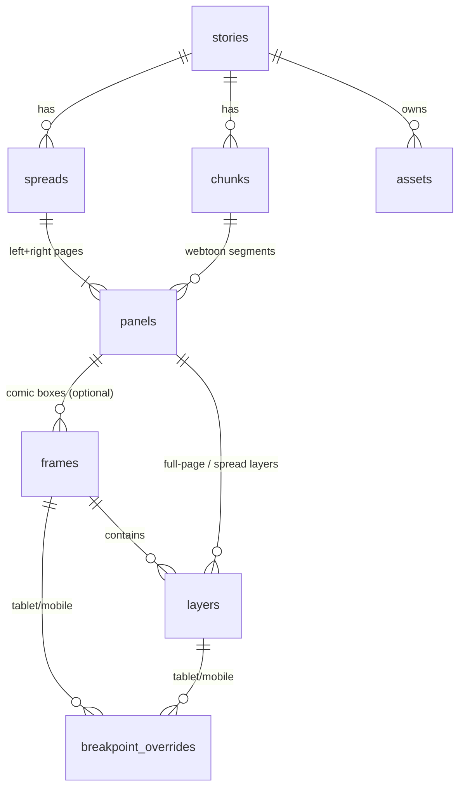

# Alexandria — Paged (Comic / Book) Data Schema
### Companion to the V1 PRD · Draft v0.1 · May 28, 2026

> **Scope.** The relational model for the paged formats (comic + book) and how they coexist with the existing webtoon model. Grounded in the **actual current types** (`src/types/index.ts`), not the April-25 spec. DDL is Postgres/Supabase flavored and **assumes the live schema matches the TS types** — verify column names/PKs against the real migrations before running.

---

## 0. What already exists (verified in code)

The codebase is well ahead of the spec. Before adding anything, here's the reality this schema builds on:

- `stories.reading_mode` already includes **`'book'`** (alongside `'cinematic'`, `'scroll'`), plus `reading_direction` (`ltr`/`rtl` — manga support), `transition_style`, `transition_duration_ms`, `read_count`.
- An **`assets`** table (media library) exists; `layers.asset_id` references it.
- **`layers` already carry everything**: media (image/gif/video/audio), **text** (`text_content`, `font_*`, `text_align`, `line_height`, `text_layer_type` = dialogue/narrative/caption/sound_fx/plain), and **speech bubbles** (`has_tail`, `tail_*`, `tip_*`, `stroke_*`, `background_color`, `border_radius`).
- **`layers.is_spread_layer`** already positions a layer relative to the full **1592×879** spread vs a single **796×879** page.
- **`layers.mobile_*`** already provide a desktop→mobile cascade (`mobile_hidden`, `mobile_x/y/width/height_percent`, "null = inherit desktop").
- In book mode today, **two consecutive `panels` = a spread** (left/right), rendered via left/right page layers + a spread overlay (`EditorCanvas.tsx`).

**Implication:** text and speech bubbles are a **carry-over, not a rebuild**. The real gaps are (1) explicit spreads, (2) comic frames, (3) a third breakpoint + a cleaner cascade.

## 1. Design principles
1. **Additive, not destructive.** Webtoon rows stay valid; new columns are nullable and new tables are opt-in. Honors the "webtoon untouched / parallel system" decision without forking the rich `layers` table.
2. **Reuse `layers` for all creative content.** One layer engine renders media, text, and bubbles in webtoon, book, and comic.
3. **A page with no frames = today's full-page book canvas.** Comic frames are an *optional* sub-level, so existing book pages keep working unchanged.
4. **Desktop is the base; tablet/mobile are overrides.** The cascade is base values + sparse override rows (the CSS-breakpoint model you asked for).

## 2. Entity hierarchy

```
stories  (reading_mode='book', page_style='paper'|'hardback')
└── spreads            (NEW · ordered turn unit; standard | full_bleed; cover handling)
    └── panels         (EXISTING · = one page; +spread_id, +page_side)
        └── frames     (NEW · rectangular comic box; optional; base geometry + reading_order)
            └── layers (EXISTING · +frame_id; media / text / speech-bubble)

breakpoint_overrides   (NEW · per-(frame|layer) × (tablet|mobile) deltas; replaces ad-hoc mobile_* cols)
assets                 (EXISTING · media library)
chunks                 (EXISTING · webtoon chapters — unchanged)
```



Note the two `panels → layers` paths: a layer either lives **in a frame** (comic) or **directly on the page/spread** (book full-page, or webtoon). `frame_id` null = the latter.

## 3. Migration SQL

```sql
-- ============================================================
-- 1. stories: comic vs book is a PRESENTATION style, not a format.
--    reading_mode='book' = the paged engine; page_style = the look.
-- ============================================================
alter table stories
  add column if not exists page_style text not null default 'hardback'
    check (page_style in ('paper', 'hardback')),   -- 'paper' = comic, 'hardback' = book
  add column if not exists back_cover_url text;     -- optional custom back cover; front cover = existing cover_url

-- ============================================================
-- 2. spreads: explicit, ordered turn unit. Replaces positional pairing.
--    A spread owns its two pages and the page-turn engine iterates these.
-- ============================================================
create table if not exists spreads (
  id          uuid primary key default gen_random_uuid(),
  story_id    uuid not null references stories(id) on delete cascade,
  position    integer not null,                    -- 0-based turn order (INTERIOR content only; covers are not spreads)
  spread_type text not null default 'standard'
    check (spread_type in ('standard', 'full_bleed')),
  -- full_bleed (RESOLVED → pre-slice): source artwork is sliced 50/50 at upload into two half-assets;
  -- the spread renders as two ordinary page layers, so StPageFlip turns them natively (no runtime split).
  -- V1 supports BOTH static images and video:
  --   • Image: left/right are sliced halves of the source image.
  --   • Video: full_bleed_asset_id holds the video; left/right hold sliced POSTER halves shown
  --     during the turn (the mid-turn freeze); at-rest the video plays as a spread-overlay
  --     via is_spread_layer mechanics across both pages.
  -- Source kept for re-editing/re-slicing.
  full_bleed_asset_id       uuid references assets(id) on delete set null,  -- original (for re-edit)
  full_bleed_left_asset_id  uuid references assets(id) on delete set null,  -- derived left half (image: half of source · video: half of poster)
  full_bleed_right_asset_id uuid references assets(id) on delete set null,  -- derived right half
  created_at  timestamptz not null default now(),
  unique (story_id, position)
);
create index if not exists spreads_story_pos on spreads (story_id, position);

-- ============================================================
-- 3. panels (= pages in paged mode): link to spread + which side.
--    Webtoon panels leave these null and are unaffected.
-- ============================================================
alter table panels
  add column if not exists spread_id uuid references spreads(id) on delete cascade,
  add column if not exists page_side text
    check (page_side in ('left', 'right'));
create index if not exists panels_spread on panels (spread_id, page_side);

-- ============================================================
-- 4. frames: rectangular comic boxes within a page. OPTIONAL.
--    Geometry is % of the PAGE (single 796px page coordinate space).
--    reading_order is spread-global (drives the mobile side-swipe sequence).
--    A page with zero frames = full-page canvas (current book behavior).
-- ============================================================
create table if not exists frames (
  id            uuid primary key default gen_random_uuid(),
  panel_id      uuid not null references panels(id) on delete cascade,  -- the page
  story_id      uuid not null references stories(id) on delete cascade, -- denormalized for RLS/queries
  position      integer not null default 0,         -- stacking / render order within the page
  reading_order integer,                            -- mobile sequence across the whole spread (1..N)
  x_percent      numeric not null default 0,
  y_percent      numeric not null default 0,
  width_percent  numeric not null default 100,
  height_percent numeric not null default 100,
  clip          boolean not null default true,       -- frame clips its layers (overflow hidden)
  gutter_px      integer not null default 0,          -- optional inner padding; gutters also emerge from geometry
  created_at    timestamptz not null default now()
);
create index if not exists frames_panel on frames (panel_id, position);

-- ============================================================
-- 5. layers: opt into living inside a frame. Existing rows untouched (frame_id null).
--    A layer is parented by EITHER a frame (comic) OR directly its panel (book full-page / webtoon).
-- ============================================================
alter table layers
  add column if not exists frame_id uuid references frames(id) on delete cascade;
create index if not exists layers_frame on layers (frame_id, position);
-- panel_id remains the page/segment the layer ultimately belongs to (kept for all rows).

-- ============================================================
-- 6. breakpoint_overrides: unify the cascade and add the tablet tier.
--    Desktop = base values on frames/layers. Rows here are sparse deltas.
--    Null delta column = inherit from the base (desktop) value.
-- ============================================================
create table if not exists breakpoint_overrides (
  id          uuid primary key default gen_random_uuid(),
  story_id    uuid not null references stories(id) on delete cascade,
  target_type text not null check (target_type in ('frame', 'layer')),
  target_id   uuid not null,                         -- frames.id or layers.id (enforced in app layer)
  breakpoint  text not null check (breakpoint in ('tablet', 'mobile')),
  x_percent      numeric,
  y_percent      numeric,
  width_percent  numeric,
  height_percent numeric,
  reading_order  integer,                            -- frame targets only
  is_hidden      boolean not null default false,
  created_at  timestamptz not null default now(),
  unique (target_type, target_id, breakpoint)
);
create index if not exists overrides_target on breakpoint_overrides (target_type, target_id, breakpoint);

-- ============================================================
-- 7. Migrate existing layer.mobile_* into the override table, then deprecate.
--    (Do this once; verify; then drop the columns in a later migration.)
-- ============================================================
insert into breakpoint_overrides (story_id, target_type, target_id, breakpoint,
                                  x_percent, y_percent, width_percent, height_percent, is_hidden)
select story_id, 'layer', id, 'mobile',
       mobile_x_percent, mobile_y_percent, mobile_width_percent, mobile_height_percent,
       coalesce(mobile_hidden, false)
from layers
where mobile_x_percent is not null or mobile_y_percent is not null
   or mobile_width_percent is not null or mobile_height_percent is not null
   or mobile_hidden = true
on conflict (target_type, target_id, breakpoint) do nothing;

-- Later, after verification:
-- alter table layers drop column mobile_x_percent, drop column mobile_y_percent,
--   drop column mobile_width_percent, drop column mobile_height_percent, drop column mobile_hidden;
```

## 4. RLS (mirror existing policies)
All new tables need RLS matching the current pattern: creators read/write rows where the owning `story_id` belongs to `auth.uid()`; anonymous users may read rows belonging to **published** stories only. `spreads`, `frames`, and `breakpoint_overrides` all carry `story_id` precisely so these policies are one-hop joins (or direct checks) like the existing `panels`/`layers` policies.

## 5. Reconciliation — exists / add / open

| Concern | Status |
|---|---|
| Text + speech bubbles | **Exists** on `layers` — carry-over |
| Spread-spanning media (full-bleed at rest) | **Exists** via `is_spread_layer` |
| Desktop→mobile cascade | **Exists** (ad-hoc `mobile_*`) → **migrate** to `breakpoint_overrides` + add tablet |
| Book pages (left/right) | **Exists** (positional) → **formalize** with `spreads` + `page_side` |
| Rectangular comic panels | **Add** `frames` |
| Comic vs book look | **Add** `page_style` |
| Page-turn engine | StPageFlip port (PRD §10) — not a schema concern, but `spreads.position` is its iteration unit |

## 6. Decisions — resolved + remaining
*#1 and #2 (the build-blocking pair) are RESOLVED below. #3–#5 have recommendations but are non-blocking; confirm at your convenience.*
1. **Covers — RESOLVED.** `stories.cover_url` is the single source for the front cover (also the dashboard thumbnail and the pre-reader Cover Screen). Covers are **not** spreads (`is_cover` dropped); the page-turn engine prepends the front cover from `cover_url` and appends a back cover from the optional `back_cover_url` (styled default if null). The end-page CTA screen (restart/exit/links) stays a separate post-turn screen as in V2. Rationale: a book's cover art and its marketing cover are the same image — one field avoids drift — and single-sided hard covers don't fit the two-page spread table. *Deferred:* multi-layer composed front cover (promotable to a special spread in V2 if requested).
2. **Full-bleed — RESOLVED → pre-slice at upload, supports image AND video in V1.** Slice the source 50/50 into two half-assets (client-side canvas) and render as two ordinary page layers, so StPageFlip turns them natively and the duplication/cropping bug class cannot recur (how Heyzine/Visme work — pre-paginated leaves). **Static image:** halves are slices of the source. **Video:** the source video is stored on `full_bleed_asset_id` and plays at rest as a spread-overlay via `is_spread_layer` mechanics; the *poster* is sliced into the two half-assets and shown during the turn (reusing the poster-generation work needed for the mid-turn freeze). A gutter-safe guide warns when content sits on the 50/50 spine split.
3. **reading_order scope.** Confirmed spread-global integer here. OK, or do you want per-page ordering with page precedence?
4. **Migrate `mobile_*` now vs later.** Step 7 migrates immediately. If you'd rather not touch webtoon rows yet, we keep `mobile_*` for V1 and add `tablet_*` columns to match — uglier, but zero migration. Recommendation: migrate now; it's a one-time, behavior-preserving move.
5. **`reading_mode` values.** Keep paged under `'book'` + `page_style`, or introduce a distinct `'comic'` reading_mode? Recommendation: keep `'book'` + `page_style` (matches "comic/book interchangeable, set in publish settings").

## 7. Suggested build order (for a Claude Code plan prompt)
1. `spreads` table + RLS; backfill existing book pages into spreads (pair consecutive panels, set `page_side`).
2. `page_style` on stories + publish-settings toggle.
3. `frames` table + RLS; editor panel-draw tool writing frames; layer reparent (`frame_id`).
4. `breakpoint_overrides` table + RLS; migrate `mobile_*`; add tablet tier in editor + reader cascade resolver.
5. Wire StPageFlip reader to iterate `spreads` (front cover from `cover_url`, back cover from `back_cover_url`); full-bleed renders as pre-sliced page layers — for video, at-rest plays as spread overlay and during-turn shows sliced poster halves.
